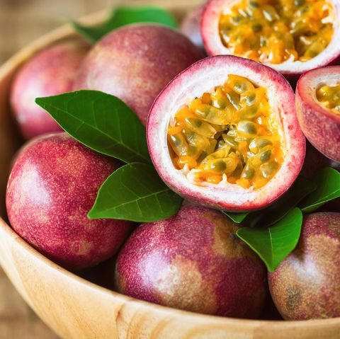
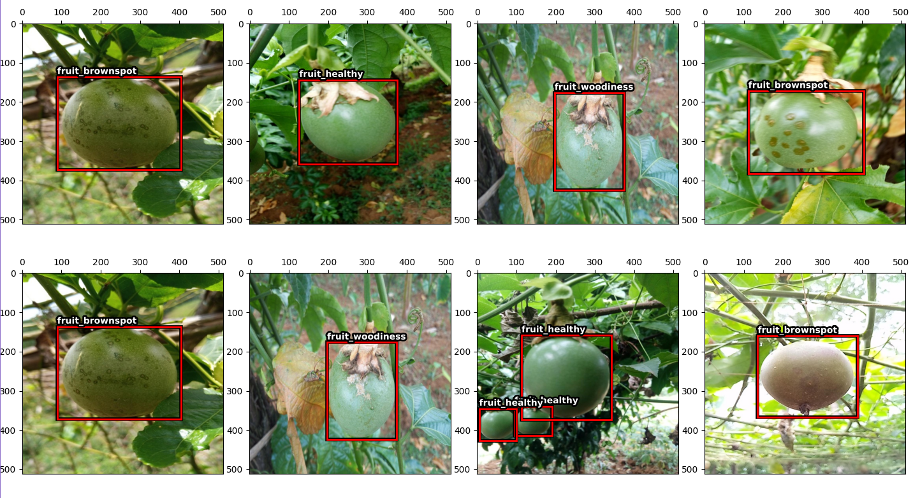
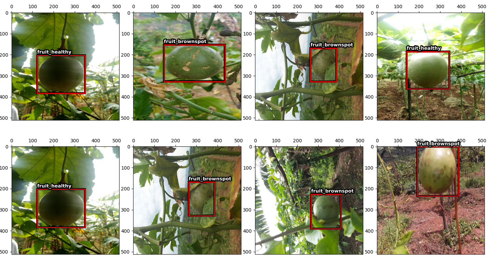

# Grenadilla Disease Detection Challenge



The objective of this challenge is to classify the disease status of a plant 
given an image of a passion fruit. You need to classify each fruit individually 
and not assume that all the fruit in the same image have the same status. 


## Input dataset
The dataset contains about 4000 images resized to **512x512**. There are **~5000** fruit in total. 
Some images contain more than one fruit and thus more than one bounding box. 
The images are annotated using bounding boxes defined in a **COCO format** and each bounding box is 
tagged to one of three classes: 
* **Fruit healthy**. 
* **Fruit brownspot**. 
* **fruit woodiness**.




## Instructions
**1 . Clone the repository:**
```bash
git clone https://github.com/Ansem-chaieb/Makerere-Passion-Fruit-Disease-Detection-Challenge.git
cd Makerere-Passion-Fruit-Disease-Detection-Challenge
```
**2 . Download custom YOLOv5 object detection data:**
```bash
zindi_dataset/
└── Test_Images/
└── Train_Images/
└── Test.csv
└── Train.csv
└── Sample_submission.csv
```
**3 . Clone YOLOv5 repository:**
```bash
git clone https://github.com/ultralytics/yolov5.git
```
Install YOLOv5 dependencies:
```bash
pip install -U -r yolov5/requirements.txt
```
**4 . Set configuration:**

Data Configuration:
- Set data paths, image size, id, target and bbox columns.
- Create custom data yaml file.
```bash
yolov5/
└── data/
    └──  makerere.yaml
```

```bash
train: yolo_dataset/makerere/images/train
val : yolo_dataset/makerere/images/validation
nc : 3
names : [ 'fruit_brownspot', 'fruit_healthy', 'fruit_woodiness']
```
Define YOLOv5 Model Configuration and Architecture:
- Set batch size, number of epochs and weights.

#### Run project
 ```bash
  python3 main.py --information --display --process_data --train --inference
  ```

  The command comes with 5 flags:

  **--information:**   Get informtions about your dataset.
  
  **--display:**       Plot batch of dataset images.
  
  **--process_data:**  Process coordinates from pascal voc to yolo, split dataset to train
                  and validation then create yolo labes files.
                  
  **--train:**         Train yolov5 on custom data.
  
  **--inference:**     Test yolov5 on custom data.


## output results
output folder :
```bash
yolov5/
└── runs/
    └──  detect
    └── train
```
```bash
output/
└── output.log
└── sub_pascal.csv
└── sub_yolo.csv
```
Exemple of test results:


